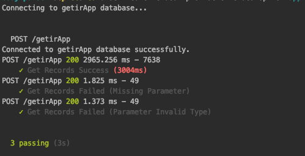

# Project Setup

Clone getirApp project.
```sh
$ git clone git@github.com:ceylansamet/getir-case-study.git
```
Install depencies.
```sh
$ npm install
```
### Dependencies

  - Express
  - dotenv
  - chai
  - async
  - express-validator
  - mongoose
  - express-swagger-generator

### Unit Test


 ```sh
$ npm test
```




 ### Run Project
 ```sh
$ npm start or node bin/www
```


 ### Swagger Documention


```sh
$ https://getir-case-study-cylnsamet.herokuapp.com/api-docs
```
| Item | Description |
| --- | --- |
| Host Url | `https://getir-case-study-cylnsamet.herokuapp.com/` |
| Route | `getirApp` |
| Http Method | `POST` |
| Content-Type | `application/json` |
| Accept | `application/json` |
| Body | `{    "startDate": "2016-02-02",    "endDate": "2019-02-02",    "minCount": 1000,    "maxCount": 10000}` |


### About me

- Author : Abdussamet Ceylan
- Email :  abdussametceylan@yandex.com
